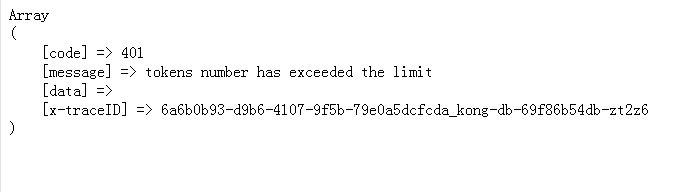

# 💡常见问题

#### 首次申请OpenAPI后没有收到邮件？

检查邮箱填写是否正确；检查邮件是否在垃圾邮件中；联系客服处理。

#### 忘记client\_id或client\_secret？

联系客服处理；如果发生泄漏，为保证数据安全，请第一时间联系客服更换`client_secret`。

#### PUT请求没有返回值？

PUT请求上传文件分片时，上传完成后HTTP请求响应200即可，无任何返回值。

#### PUT请求异常了该怎么办？

请您将截图提供给客服排查异常响应。

#### PUT请求是否需要携带Authorization和Platform？

不需要。

#### 如果接口提示 tokens number has exceeded the imit 该怎么办？

出现这个提示说明您的账号登录数量过多，请及时退出登录，来保证当前设备可用性。

#### API是否有QPS限制？

不同的API的QPS限制不同，详情请见开发须知。

> 更新: 2025-03-17 19:17:04  
> 原文: <https://123yunpan.yuque.com/org-wiki-123yunpan-muaork/cr6ced/ghfd4h0l6c6y6oi8>