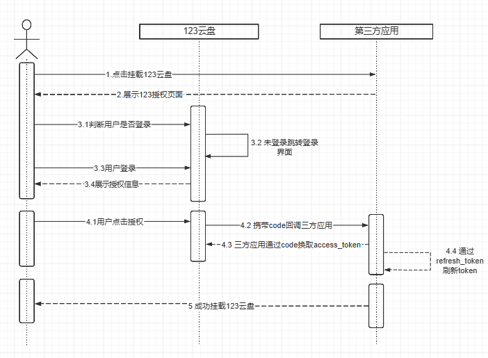

# 授权须知

## 注意事项

**请求地址=域名+URL**

授权正式域名：[https://www.123pan.com](about:blank)

接口正式域名：[https://open-api.123pan.com](about:blank)

## 资质认证

为了确保对接的高效性，对接应用需提供如下应用信息：

1. 产品简介、产品用户量、日活、付费服务等
2. 对接应用的ICP备案信息、营业执照等复印件（暂不支持个人开发者接入）

如上信息发送至123云盘商务邮箱 bd@123pan.com，等待审核，审核结果会在7个工作日内答复，请耐心等待。

## 授权流程

**准备工作：**

1. 申请人经123云盘商务邮箱 bd@123pan.com对接确认，并向123云盘提供“应用授权回调地址”和“对接应用的logo（圆角）“
2. 123云盘收到所提供的信息后，会向申请人提供`appId`，`secretId`
3. 申请人开始对接，过程中如有任何疑问，可与商务进行沟通确认

**接入流程：**

## 常用code码

| **body 中的 code** | **描述** |
| :---: | :---: |
| 1 | 内部错误 |
| 401 | access\_token无效 |
| 429 | 请求太频繁 |
| 5066 | 文件不存在 |
| 5113 | 流量超限 |

## 限流处理

| **API** | **限制QPS（同一个uid，每秒最大请求次数）** |
| --- | --- |
| upload/v1/file/create | 5 |
| upload/v1/file/get\_upload\_url | 20 |
| upload/v1/file/list\_upload\_parts | 20 |
| upload/v1/file/mkdir | 5 |
| upload/v1/file/upload\_async\_result | 5 |
| upload/v1/file/upload\_complete | 20 |
| api/v1/file/delete | 1 |
| api/v1/access\_token | 8 |
| api/v1/file/list | 1 |
| api/v1/file/trash | 5 |
| api/v1/file/move | 10 |
| api/v1/user/info | 10 |
| api/v2/file/list | 15 |
| api/v1/video/transcode/list | 1 |
| api/v1/file/infos | 10 |
| api/v1/file/download\_info | 5 |

| **API** | **限制QPS（同一个uid，每分钟最大请求次数）** |
| --- | --- |
| api/v1/oauth2/access\_token | 100（触发限流，会限制IP） |

> 更新: 2025-10-14 16:14:58  
> 原文: <https://123yunpan.yuque.com/org-wiki-123yunpan-muaork/cr6ced/kf05anzt1r0qnudd>